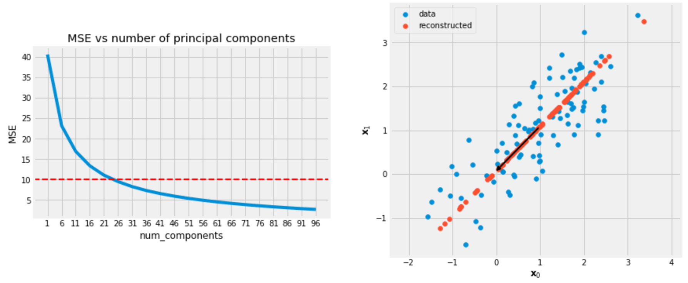

# Mathematics-for-ML
Mathematics for ML

The codes are part of the course [Mathematics for Machine Learning: PCA](https://www.coursera.org/learn/pca-machine-learning/home/welcome) on Coursera by Imperial College, London. 
